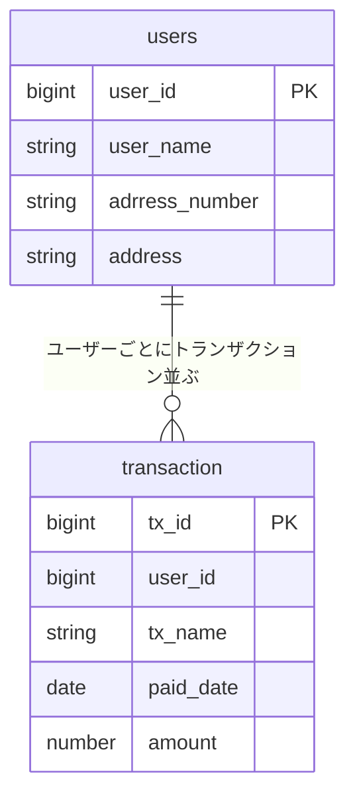

# はじめに

## 作りたいもの

- 外注先への支払情報を蓄積する
- そこから全銀フォーマットを生成する
- それに関する源泉徴収の情報を集約する
- そこに係る源泉徴収情報を出力し、csvをアップロードする
- 源泉徴収の納付を行う

```mermaid
erDiagram
  users{
    bigint user_id PK
    string user_name
    string adrress_number
    string address
  }

  transaction{
    bigint tx_id PK
    bigint user_id
    string tx_name
    date paid_date
    number amount
  }

  users||--o{transaction:"ユーザーごとにトランザクション並ぶ"
```
